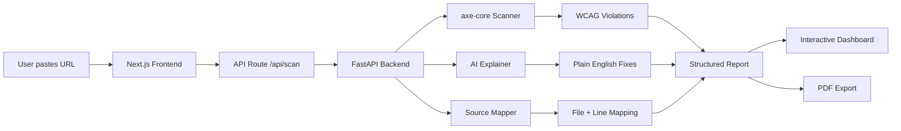

<div align="center">

# 🌐 Lumio — AI-Powered Accessibility Scanner

**1 billion people navigate the web with disabilities.**
**Most websites fail them silently. Lumio changes that.**

Paste any URL → get every WCAG violation → get the exact code fix.

[Live Demo](#getting-started) · [How It Works](#how-it-works) · [Tech Stack](#tech-stack)

</div>

---

## 🔴 The Problem

Accessibility isn't optional — it's a legal requirement (ADA, EAA 2025) and a moral one. Yet **96.3% of websites** have detectable WCAG failures ([WebAIM 2024](https://webaim.org/projects/million/)).

Existing tools fail developers in three ways:

| Problem | What happens |
|---|---|
| **Score-only tools** | Tell you "your score is 72" but not *what's broken* or *how to fix it* |
| **Generic advice** | Say "add alt text" but never point to the exact element or line of code |
| **Overwhelming reports** | Dump 200+ violations with no prioritization — teams don't know where to start |

### The result?
Developers ignore accessibility. Fixes get pushed to "later." Millions of users can't navigate, read, or interact with the web.

---

## 🟢 Our Solution

Lumio is an **AI-powered accessibility scanner** that doesn't just find problems — it **fixes them for you**.

### What makes Lumio different:

```
Traditional Tool:  "Your site has 4 accessibility issues."
Lumio:             "Line 1 of your homepage — the <html> element is missing a lang 
                    attribute. Screen readers can't determine the page language. 
                    Here's the fix: <html lang='en'>"
```

### Core capabilities:

- **🔍 Deep WCAG Scanning** — Automated axe-core analysis finds every violation across Perceivable, Operable, Understandable, and Robust principles
- **🤖 AI-Powered Explanations** — Each issue is explained in plain English: what's broken, who's affected, and why it matters
- **💻 Exact Code Fixes** — Before/after code diffs for every violation. Not "add alt text" — the actual `` fix
- **📊 Visual Analytics** — Interactive pie charts, WCAG category scores, score trends, issue type distribution, and fix impact estimates
- **📋 PDF Export** — Professional, shareable reports with step-by-step fix instructions for every issue
- **🎯 Smart Prioritization** — Issues ranked by severity, business impact, and affected user count — fix what matters first
- **📄 Multi-page Scanning** — Scan 1, 2, or 5 pages at once to catch issues across your entire site

---

## 🏗️ How It Works



### Step-by-step:

1. **URL Input** — User enters a website URL and selects page count (1/2/5)
2. **Backend Scan** — FastAPI server launches a headless browser, loads the page, and runs axe-core accessibility analysis
3. **AI Processing** — Each violation is sent to an LLM (via NVIDIA/OpenRouter API) which generates:
   - A plain-English explanation of what's wrong
   - Who is affected (screen reader users, keyboard users, etc.)
   - The exact code fix (before → after)
   - Business priority ranking
4. **Source Mapping** — Violations are mapped to HTML elements with file + line number references
5. **Deduplication** — Identical issues across pages are grouped to reduce noise
6. **Monitoring** — Each scan is stored for trend comparison (previous vs. current score)
7. **Results Dashboard** — Interactive UI with expandable issue cards, charts, and one-click copy
8. **PDF Export** — Clean, professional report generated client-side with jsPDF

---

## 🎨 Features in Detail

### Beginner-Friendly Issue Cards

Each issue card is designed so even someone who's never fixed an accessibility bug can follow along:

- **#1 of 4** — Numbered so you know where you are
- **Easy fix · ~1 min** — Difficulty level + time estimate
- **Expandable** — Click to reveal full details, collapsed by default
- **Step-by-step instructions** — "1. Open file X → 2. Find this code → 3. Replace with the green version"
- **One-click copy** — Copy the fixed code to clipboard
- **Before/After code diff** — Red = broken, Green = fixed

### Interactive Analytics Dashboard

Five live charts powered by real scan data:

| Chart | Purpose |
|---|---|
| **Severity Pie Chart** | Hover each segment → center shows that severity's count and percentage |
| **WCAG Category Bars** | Perceivable / Operable / Understandable / Robust scores |
| **Score Trend Line** | Compare previous scan vs. current scan |
| **Issue Type Distribution** | Which types of issues appear most often |
| **Fix Impact Estimate** | Projected improvement in SEO, UX, Compliance, and Screen Reader support |

### Professional PDF Reports

One-click export generates a multi-page PDF with:
- Dark branded cover header
- Score summary cards
- Per-issue breakdown with code diffs
- Step-by-step fix instructions
- Page numbers and timestamps

---

## 🛠️ Tech Stack

| Layer | Technology |
|---|---|
| **Frontend** | Next.js 16, React 19, TypeScript |
| **Styling** | Tailwind CSS v4, Framer Motion |
| **Charts** | Custom SVG (zero dependencies) |
| **PDF Export** | jsPDF (client-side generation) |
| **Backend** | Python FastAPI |
| **Scanner** | axe-core (via Playwright headless browser) |
| **AI Engine** | NVIDIA API / OpenRouter (LLM-powered explanations) |
| **Icons** | Lucide React |

### Project Structure

```
bugbash/
├── src/
│   ├── app/
│   │   ├── api/scan/route.ts    # Next.js API proxy to backend
│   │   └── page.tsx             # Main landing page
│   ├── components/
│   │   ├── HeroSection.tsx      # Main scan UI + results dashboard
│   │   ├── ScanCharts.tsx       # 5 interactive chart visualizations
│   │   ├── URLAnalyzerInput.tsx  # URL input + page selector
│   │   ├── PuzzleAnalysis.tsx   # Scanning animation
│   │   └── LiquidReveal.tsx     # WebGL hero effect
│   └── lib/
│       ├── generatePDF.ts       # PDF report generator
│       └── utils.ts             # Utility functions
├── backend/
│   ├── main.py                  # FastAPI server + scan orchestration
│   ├── scanner.py               # axe-core website scanner
│   ├── ai_explainer.py          # LLM-powered fix generation
│   ├── source_mapper.py         # Element → file/line mapping
│   ├── prompt_builder.py        # AI prompt templates
│   ├── monitor_store.py         # Scan history + trend tracking
│   └── models.py                # Pydantic data models
└── public/                      # Static assets
```

---

## 🚀 Getting Started

### Prerequisites

- Node.js 18+
- Python 3.10+
- NVIDIA API key or OpenRouter API key

### 1. Clone and install

```bash
git clone https://github.com/your-org/lumio.git
cd lumio
npm install
```

### 2. Set up the backend

```bash
cd backend
pip install -r requirements.txt
```

Create `backend/.env`:
```env
NVIDIA_API_KEY=your_nvidia_api_key
OPENROUTER_API_KEY=your_openrouter_key
```

### 3. Run both servers

**Terminal 1 — Backend:**
```bash
cd backend
python main.py
```

**Terminal 2 — Frontend:**
```bash
npm run dev
```

Open [http://localhost:3000](http://localhost:3000) and paste a URL to scan.

---

## 🎯 Our Approach

### Philosophy: Fix > Score

Most accessibility tools give you a number. Lumio gives you a **working code patch**.

We believe:
1. **Developers don't need more scores** — they need faster fixes
2. **Beginners should feel confident** — step-by-step, not jargon-heavy
3. **AI should do the hard work** — explaining *why* something is broken and generating the exact fix
4. **Prioritization is a differentiator** — tell teams what to fix *first*, not just what to fix
5. **Visual proof builds trust** — charts, trends, and exportable reports make the case to stakeholders

### Design Decisions

- **Data mapping at the API layer** — Backend returns raw violations; Next.js API route transforms them into a standardized format the frontend consumes. This keeps React components "dumb" and focused on rendering.
- **CSS-only charts** — All 5 visualizations are built with inline SVG + CSS transitions. Zero charting library dependencies.
- **Client-side PDF** — Reports are generated in the browser with jsPDF. No server round-trip, instant download.
- **Asymptotic progress** — The loading animation uses an exponential decay curve so progress feels natural across varying scan durations (10s–90s).

---

## 📄 License

MIT

---

<div align="center">

**Built for the hackathon. Built for everyone.**

*Because accessibility isn't a feature — it's a right.*

</div>
